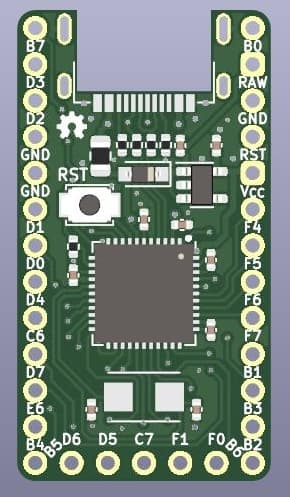
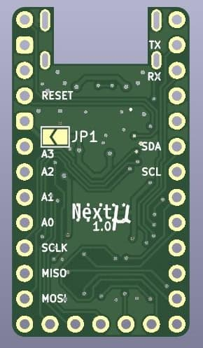
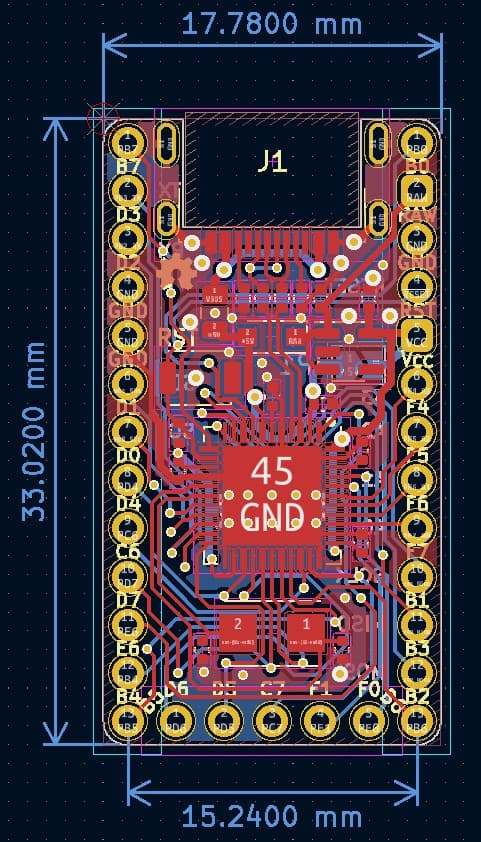

# Next *μ*

**Next *μ*** or **Next Micro** is a Pro Micro/[Elite-C](https://deskthority.net/wiki/Elite-C) compatible ATmega32U4 board, specialized design for keyboards.

It has mid-mount USB Type-C and more available pins (25 pins, all pins of ATmega32U4 except `PE2/HWB`) than both Pro Micro (18 pins) and Elite-C (24 pins).  
The on-board RESET button makes development easier.

> A part of [ErgoSNM keyboard](https://github.com/ziteh/ergo-snm-keyboard) project.  

## Preview

| Front                           | Back                           | Layers                    |
| ------------------------------- | ------------------------------ | ------------------------- |
|  |  |  |

## Pinouts
| Func | 32U4  | L <-> R |  32U4 | Func |
| :--- | :---- | :-----: | ----: | ---: |
|      | PB7\* |         |   PB0 |      |
| TX   | PD3   |         |   RAW |      |
| RX   | PD2   |         |   GND |      |
|      | GND   |         | RESET |      |
|      | GND   |         |   VCC |      |
| SDA  | PD1   |         |   PF4 |   A3 |
| SCL  | PD0\* |         |   PF5 |   A2 |
| A6   | PD4   |         |   PF6 |   A1 |
|      | PC6\* |         |   PF7 |   A0 |
| A7   | PD7\* |         |   PB1 | SCLK |
|      | PE6   |         |   PB3 | MISO |
| A8   | PB4   |         |   PB2 | MOSI |
| A9   | PB5\* |         | PB6\* |  A10 |

Bottom row from left to right: PD6, PD5, PC7\*, PF1, PF0.

- The pin marked with `*` can output PWM.
- RAW: LDO Vin pin.

> The pinouts not fully compatible with Elite-C.

## Jumper Config

- JP1: LDO bypass.
  - Open: VCC is 3.3V (LDO Vout).
  - Closed: VCC is 5V (VBUS or RAW). 

## BOM

| Designator  | Value                   | Footprint                           |
| ----------- | ----------------------- | ----------------------------------- |
| C1,C2       | 20pF                    | 0402 (1005 Metric)                  |
| C3,C6,C7    | 100nF                   | 0402 (1005 Metric)                  |
| C4,C5,C8,C9 | 1uF                     | 0402 (1005 Metric)                  |
| D1          | B5817                   | SOD-323                             |
| F1          | 500mA, 6V               | 0805 (2012 Metric)                  |
| J1          | USB_C_Receptacle_USB2.0 | 918-418K2024S40000                  |
| R1,R2       | 5.1k                    | 0402 (1005 Metric)                  |
| R3,R4       | 22                      | 0402 (1005 Metric)                  |
| R5          | 10k                     | 0402 (1005 Metric)                  |
| SW1         | RESET                   | B3U-1000P                           |
| U1          | ATmega32U4-M            | QFN-44-1EP 7x7mm P0.5mm EP5.2x5.2mm |
| U2          | RT9013-33GB             | SOT-23-5                            |
| Y1          | 8MHz                    | 2Pin 5x3.2mm                        |
> See also [`doc/next-micro_bom.csv`](./doc/next-micro_bom.csv).

There is not designator silkscreen on PCB, please use your browser to open the `ibom.html` file (placed in [release page][release] and [`doc/`](./doc/)) to refer to the placement of the parts, it is generated by [Interactive HTML BOM](https://github.com/openscopeproject/InteractiveHtmlBom) plugin.

## PCBA

The BOM and CPL files for PCBA are placed in the [`doc/`](./doc/) folder and [release page][release].

## Board Characteristics

- Copper layer count: 2
- Board thickness: 1.6 mm
- Board overall dimensions: 17.78 x 33.02 mm (0.7 x 1.3 inch)
- Min track/spacing: 0.13 mm / 0.13 mm
- Min hole diameter: 0.3 mm
- Castellated pads: No
- Edge card connectors: No
- Plated board edge: No

## Disclaimer

These files without warranty of any kind, use at your own risk, it is recommended to check yourself before manufacture.

For the full statement, please see [LICENSE](./LICENSE).

[release]: https://github.com/ziteh/next-micro/releases
